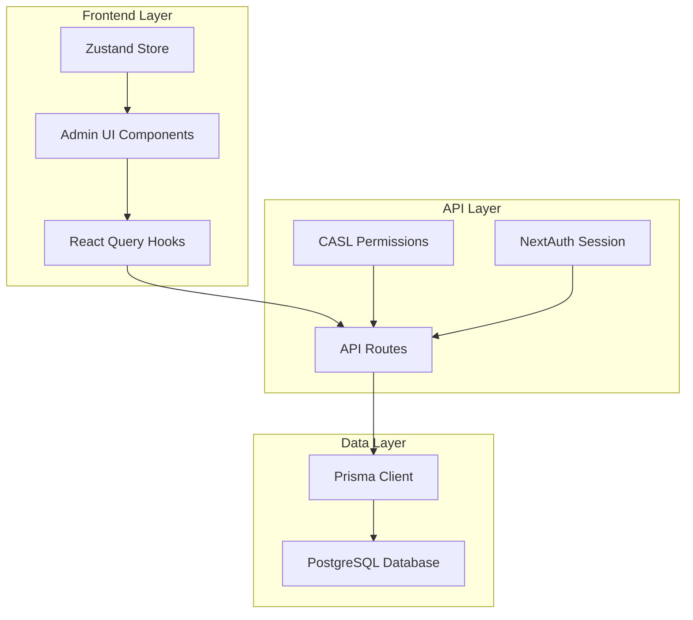
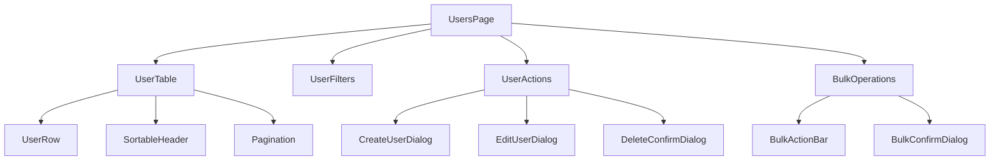

# Design Document

## Overview

The enhanced admin user management system will build upon the existing architecture while adding comprehensive CRUD operations, advanced filtering, search capabilities, and bulk operations. The design follows the established patterns in the codebase using Next.js App Router, Prisma ORM, TanStack Query for state management, and shadcn/ui components.

## Architecture

### High-Level Architecture



### Component Architecture



## Components and Interfaces

### Core Data Types

```typescript
// Enhanced User interface
interface User {
  id: string;
  email: string;
  first_name: string;
  last_name: string;
  is_active: boolean;
  created_at: string;
  updated_at: string;
  last_login?: string;
  last_logout?: string;
  avatar?: string;
  role?: {
    id: string;
    name: UserRole;
    permissions: string[];
    description?: string;
  };
  // Computed fields
  full_name: string;
  status: "active" | "inactive" | "banned";
  activity_status: "online" | "offline" | "never";
}

// Filter and sort interfaces
interface UserFilters {
  search: string;
  role: string | null;
  status: "active" | "inactive" | null;
  dateRange: {
    from: Date | null;
    to: Date | null;
  } | null;
  sortBy: "full_name" | "email" | "created_at" | "last_login" | "role";
  sortOrder: "asc" | "desc";
}

interface PaginationParams {
  page: number;
  pageSize: number;
  total: number;
}

// API Response types
interface UsersResponse {
  users: User[];
  pagination: PaginationParams;
  filters: UserFilters;
}

interface BulkOperationResult {
  success: number;
  failed: number;
  errors: string[];
}
```

### API Endpoints Design

#### Enhanced User Management API

```typescript
// GET /api/admin/users - Enhanced with query parameters
interface GetUsersParams {
  page?: number;
  pageSize?: number;
  search?: string;
  role?: string;
  status?: "active" | "inactive";
  sortBy?: string;
  sortOrder?: "asc" | "desc";
  dateFrom?: string;
  dateTo?: string;
}

// POST /api/admin/users/bulk - New bulk operations endpoint
interface BulkOperationRequest {
  operation: "ban" | "unban" | "delete" | "assign_role";
  userIds: string[];
  roleId?: string; // For assign_role operation
}

// GET /api/admin/users/export - New export endpoint
interface ExportParams {
  format: "csv" | "excel" | "json";
  filters?: UserFilters;
}
// POST /api/admin/users/import - New import endpoint
interface ImportRequest {
  file: File;
  options: {
    skipDuplicates: boolean;
    updateExisting: boolean;
  };
}
```

### Component Specifications

#### 1. Enhanced UserTable Component

```typescript
interface UserTableProps {
  users: User[];
  loading: boolean;
  filters: UserFilters;
  pagination: PaginationParams;
  selectedUsers: string[];
  onSort: (column: string) => void;
  onSelectUser: (userId: string) => void;
  onSelectAll: (selected: boolean) => void;
  onEdit: (user: User) => void;
  onDelete: (userId: string) => void;
  onToggleStatus: (userId: string, status: boolean) => void;
}
```

Features:

- Sortable columns with visual indicators
- Row selection with checkboxes
- Inline status toggle buttons
- Role badges with permission tooltips
- Responsive design with mobile-friendly layout
- Virtual scrolling for large datasets

#### 2. Advanced UserFilters Component

```typescript
interface UserFiltersProps {
  filters: UserFilters;
  roles: Role[];
  onFiltersChange: (filters: Partial<UserFilters>) => void;
  onClearFilters: () => void;
  onExport: (format: "csv" | "excel") => void;
}
```

Features:

- Real-time search with debouncing
- Multi-select role filter
- Status filter (active/inactive/all)
- Date range picker for creation date
- Quick filter presets (e.g., "Recently created", "Never logged in")
- Export functionality

#### 3. BulkOperations Component

```typescript
interface BulkOperationsProps {
  selectedUsers: string[];
  onBulkBan: (userIds: string[]) => void;
  onBulkUnban: (userIds: string[]) => void;
  onBulkDelete: (userIds: string[]) => void;
  onBulkAssignRole: (userIds: string[], roleId: string) => void;
  onClearSelection: () => void;
}
```

Features:

- Floating action bar when users are selected
- Confirmation dialogs with operation details
- Progress indicators for long-running operations
- Undo functionality for reversible operations

#### 4. Enhanced User Dialog Components

```typescript
interface UserDialogProps {
  user?: User; // undefined for create, User for edit
  roles: Role[];
  open: boolean;
  onClose: () => void;
  onSave: (userData: CreateUserRequest | UpdateUserRequest) => void;
}
```

Features:

- Form validation with Zod schemas
- Role selection with permission preview
- Avatar upload functionality
- Password strength indicator
- Real-time email availability check

## Data Models

### Enhanced Database Queries

#### Optimized User Listing Query

```sql
-- Optimized query with proper indexing
SELECT
  u.id,
  u.email,
  u.first_name,
  u.last_name,
  u.is_active,
  u.created_at,
  u.updated_at,
  u.last_login,
  u.avatar,
  r.id as role_id,
  r.name as role_name,
  r.permissions,
  r.description as role_description,
  CONCAT(u.first_name, ' ', u.last_name) as full_name
FROM users u
LEFT JOIN roles r ON u.role_id = r.id
WHERE
  ($1::text IS NULL OR
   u.first_name ILIKE $1 OR
   u.last_name ILIKE $1 OR
   u.email ILIKE $1 OR
   CONCAT(u.first_name, ' ', u.last_name) ILIKE $1)
  AND ($2::uuid IS NULL OR u.role_id = $2)
  AND ($3::boolean IS NULL OR u.is_active = $3)
  AND ($4::timestamp IS NULL OR u.created_at >= $4)
  AND ($5::timestamp IS NULL OR u.created_at <= $5)
ORDER BY
  CASE WHEN $6 = 'full_name' AND $7 = 'asc' THEN CONCAT(u.first_name, ' ', u.last_name) END ASC,
  CASE WHEN $6 = 'full_name' AND $7 = 'desc' THEN CONCAT(u.first_name, ' ', u.last_name) END DESC,
  CASE WHEN $6 = 'email' AND $7 = 'asc' THEN u.email END ASC,
  CASE WHEN $6 = 'email' AND $7 = 'desc' THEN u.email END DESC,
  CASE WHEN $6 = 'created_at' AND $7 = 'asc' THEN u.created_at END ASC,
  CASE WHEN $6 = 'created_at' AND $7 = 'desc' THEN u.created_at END DESC,
  CASE WHEN $6 = 'last_login' AND $7 = 'asc' THEN u.last_login END ASC,
  CASE WHEN $6 = 'last_login' AND $7 = 'desc' THEN u.last_login END DESC
LIMIT $8 OFFSET $9;
```

#### Required Database Indexes

```sql
-- Indexes for optimal performance
CREATE INDEX idx_users_search ON users USING gin(
  to_tsvector('english', first_name || ' ' || last_name || ' ' || email)
);
CREATE INDEX idx_users_role_id ON users(role_id);
CREATE INDEX idx_users_is_active ON users(is_active);
CREATE INDEX idx_users_created_at ON users(created_at);
CREATE INDEX idx_users_last_login ON users(last_login);
CREATE INDEX idx_users_email_unique ON users(email);
```

### Prisma Query Optimizations

```typescript
// Optimized Prisma queries
const getUsersWithFilters = async (params: GetUsersParams) => {
  const where: Prisma.UserWhereInput = {};

  // Search across multiple fields
  if (params.search) {
    where.OR = [
      { first_name: { contains: params.search, mode: "insensitive" } },
      { last_name: { contains: params.search, mode: "insensitive" } },
      { email: { contains: params.search, mode: "insensitive" } },
    ];
  }

  // Role filter
  if (params.role) {
    where.role_id = params.role;
  }

  // Status filter
  if (params.status !== undefined) {
    where.is_active = params.status === "active";
  }

  // Date range filter
  if (params.dateFrom || params.dateTo) {
    where.created_at = {};
    if (params.dateFrom) where.created_at.gte = new Date(params.dateFrom);
    if (params.dateTo) where.created_at.lte = new Date(params.dateTo);
  }

  const [users, total] = await Promise.all([
    prisma.user.findMany({
      where,
      include: {
        role: {
          select: {
            id: true,
            name: true,
            permissions: true,
            description: true,
          },
        },
      },
      orderBy: getOrderBy(params.sortBy, params.sortOrder),
      skip: (params.page - 1) * params.pageSize,
      take: params.pageSize,
    }),
    prisma.user.count({ where }),
  ]);

  return { users, total };
};
```

## Error Handling

### API Error Responses

```typescript
interface ApiErrorResponse {
  error: string;
  code: string;
  details?: any;
  timestamp: string;
}

// Standardized error codes
enum UserManagementErrorCodes {
  USER_NOT_FOUND = "USER_NOT_FOUND",
  EMAIL_ALREADY_EXISTS = "EMAIL_ALREADY_EXISTS",
  CANNOT_DELETE_SELF = "CANNOT_DELETE_SELF",
  CANNOT_BAN_SELF = "CANNOT_BAN_SELF",
  INVALID_ROLE = "INVALID_ROLE",
  INSUFFICIENT_PERMISSIONS = "INSUFFICIENT_PERMISSIONS",
  BULK_OPERATION_FAILED = "BULK_OPERATION_FAILED",
}
```

### Client-Side Error Handling

```typescript
// Enhanced error handling with user-friendly messages
const errorMessages = {
  [UserManagementErrorCodes.USER_NOT_FOUND]: "User not found",
  [UserManagementErrorCodes.EMAIL_ALREADY_EXISTS]:
    "Email address is already in use",
  [UserManagementErrorCodes.CANNOT_DELETE_SELF]:
    "You cannot delete your own account",
  [UserManagementErrorCodes.CANNOT_BAN_SELF]: "You cannot ban your own account",
  [UserManagementErrorCodes.INVALID_ROLE]: "Selected role is invalid",
  [UserManagementErrorCodes.INSUFFICIENT_PERMISSIONS]:
    "You do not have permission to perform this action",
  [UserManagementErrorCodes.BULK_OPERATION_FAILED]:
    "Some operations failed. Please check the details.",
};
```

## Testing Strategy

### Unit Testing

1. **API Route Tests**

   - Test all CRUD operations with various input scenarios
   - Test permission checks with different user roles
   - Test error handling and edge cases
   - Test bulk operations with partial failures

2. **Component Tests**

   - Test user table rendering with different data states
   - Test filter functionality and state management
   - Test bulk selection and operations
   - Test form validation and submission

3. **Hook Tests**
   - Test React Query hooks with mock API responses
   - Test optimistic updates and cache invalidation
   - Test error handling and retry logic

### Integration Testing

1. **End-to-End User Flows**

   - Complete user creation workflow
   - User search and filtering scenarios
   - Bulk operations with confirmation dialogs
   - Role assignment and permission changes

2. **Performance Testing**
   - Large dataset handling (1000+ users)
   - Search performance with various query types
   - Bulk operation performance
   - Memory usage during long sessions

### Accessibility Testing

1. **Keyboard Navigation**

   - Tab order through all interactive elements
   - Keyboard shortcuts for common actions
   - Focus management in dialogs and modals

2. **Screen Reader Compatibility**
   - ARIA labels for all interactive elements
   - Proper heading structure
   - Table accessibility with row/column headers

## Performance Considerations

### Frontend Optimizations

1. **Virtual Scrolling**: Implement virtual scrolling for large user lists
2. **Debounced Search**: Debounce search input to reduce API calls
3. **Optimistic Updates**: Update UI immediately for better UX
4. **Lazy Loading**: Load user details on demand
5. **Memoization**: Use React.memo and useMemo for expensive computations

### Backend Optimizations

1. **Database Indexing**: Proper indexes for search and filter queries
2. **Query Optimization**: Efficient Prisma queries with proper includes
3. **Caching**: Redis caching for frequently accessed data
4. **Pagination**: Server-side pagination to limit data transfer
5. **Bulk Operations**: Batch database operations for better performance

### Monitoring and Analytics

1. **Performance Metrics**: Track API response times and error rates
2. **User Analytics**: Monitor admin usage patterns
3. **Error Tracking**: Comprehensive error logging and alerting
4. **Database Performance**: Monitor query performance and optimization opportunities

## Security Considerations

### Authentication and Authorization

1. **Session Validation**: Verify admin session on every request
2. **Permission Checks**: Use CASL for granular permission control
3. **Rate Limiting**: Implement rate limiting for API endpoints
4. **Audit Logging**: Log all admin actions for compliance

### Data Protection

1. **Input Validation**: Validate and sanitize all user inputs
2. **SQL Injection Prevention**: Use parameterized queries
3. **XSS Protection**: Sanitize output data
4. **CSRF Protection**: Implement CSRF tokens for state-changing operations

### Privacy Compliance

1. **Data Minimization**: Only collect and display necessary user data
2. **Data Retention**: Implement data retention policies
3. **Export Controls**: Limit data export capabilities
4. **Anonymization**: Option to anonymize deleted user data
