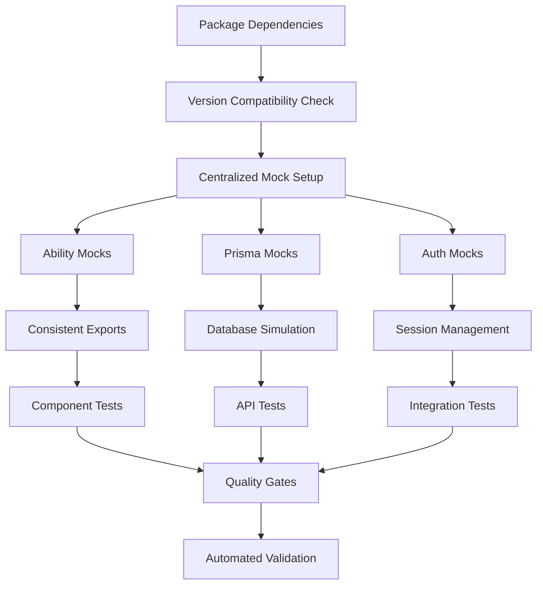

# Design Document

## Overview

This design outlines a comprehensive, systematic approach to fix all 103 failing unit tests and establish a robust, maintainable testing infrastructure for the admin user management system. The solution addresses six critical areas: package version standardization, mock consistency, component accessibility, API test reliability, code structure optimization, and automated quality gates. The approach follows a dependency-first strategy to prevent infinite error loops and ensure sustainable development practices.

## Architecture

### Test Fix Strategy

The fix strategy follows a dependency-first, layered approach to prevent cascading failures:

1. **Dependency Layer**: Standardize package versions and resolve conflicts
2. **Foundation Layer**: Fix core mock mismatches and import errors
3. **Structure Layer**: Establish consistent code organization and patterns
4. **Component Layer**: Resolve component accessibility and selector issues
5. **API Layer**: Fix API endpoint test failures
6. **Integration Layer**: Ensure all tests work together
7. **Quality Layer**: Implement automated quality gates and monitoring

### Comprehensive Testing Architecture



### Package Version Management


## Components and Interfaces

### 1. Package Version Management Module

**Purpose**: Ensure all dependencies are compatible and properly configured

**Key Components**:

- `package.json` validation and optimization
- Peer dependency resolution
- Version compatibility matrix
- Dependency conflict detection

**Interface**:

```typescript
// Package Compatibility Interface
export interface PackageCompatibility {
  react: "19.1.0";
  "@testing-library/react": "16.3.0";
  vitest: "3.2.4";
  storybook: "9.0.18";
  typescript: "5.9.2";
  nextjs: "15.4.2";
}

// Dependency Validation
export interface DependencyValidator {
  validateCompatibility: () => ValidationResult;
  resolveConflicts: () => ResolutionPlan;
  updateDependencies: (plan: ResolutionPlan) => Promise<void>;
}
```

### 2. Mock Standardization Module

**Purpose**: Ensure all mocks match actual exports and provide consistent interfaces

**Key Components**:

- `__mocks__/ability.ts` - Centralized ability mock with correct exports
- `__mocks__/prisma.ts` - Standardized database mock
- `__mocks__/auth.ts` - Authentication mock utilities

**Interface**:

```typescript
// Ability Mock Interface
export interface AbilityMock {
  createAbility: jest.MockedFunction<typeof createAbility>;
  defineAbilitiesFor: jest.MockedFunction<typeof defineAbilitiesFor>;
  UserRole: typeof UserRole;
}

// Prisma Mock Interface
export interface PrismaMock {
  user: {
    findMany: jest.MockedFunction<any>;
    create: jest.MockedFunction<any>;
    update: jest.MockedFunction<any>;
    delete: jest.MockedFunction<any>;
    count: jest.MockedFunction<any>;
  };
  role: {
    findMany: jest.MockedFunction<any>;
  };
}
```

### 2. Component Test Utilities

**Purpose**: Provide consistent utilities for testing components with proper accessibility

**Key Components**:

- `test-utils/component-helpers.ts` - Reusable component testing utilities
- `test-utils/accessibility-helpers.ts` - Accessibility testing helpers
- `test-utils/form-helpers.ts` - Form interaction utilities

**Interface**:

```typescript
export interface ComponentTestUtils {
  renderWithProviders: (component: ReactElement) => RenderResult;
  findFormField: (name: string, type?: string) => HTMLElement;
  selectOption: (selectElement: HTMLElement, value: string) => Promise<void>;
  submitForm: (form: HTMLElement) => Promise<void>;
}
```

### 4. API Test Framework

**Purpose**: Standardize API endpoint testing with proper mocks and error handling

**Key Components**:

- `test-utils/api-helpers.ts` - API testing utilities
- `test-utils/request-builders.ts` - Request building helpers
- `test-utils/response-validators.ts` - Response validation utilities

**Interface**:

```typescript
export interface APITestFramework {
  createMockRequest: (data: any, options?: RequestOptions) => NextRequest;
  mockAuthSession: (user: User, permissions: string[]) => void;
  validateResponse: (response: Response, expected: any) => void;
}
```

### 5. Code Structure Management

**Purpose**: Establish consistent patterns and organization across the codebase

**Key Components**:

- Component organization standards
- Test file co-location patterns
- Storybook story conventions
- Import/export consistency

**Interface**:

```typescript
export interface CodeStructureStandards {
  componentPattern: {
    location: "src/components/{domain}/{ComponentName}.tsx";
    test: "src/components/{domain}/{ComponentName}.test.tsx";
    story: "src/stories/{domain}/{ComponentName}.stories.tsx";
  };
  importPattern: {
    internal: "@/components/...";
    external: "package-name";
    types: "@/types/...";
  };
}
```

### 6. Quality Gate System

**Purpose**: Automated validation and regression prevention

**Key Components**:

- Pre-commit hooks for test validation
- Build-time quality checks
- Performance monitoring
- Coverage tracking

**Interface**:

```typescript
export interface QualityGates {
  preCommit: {
    runTests: boolean;
    checkLinting: boolean;
    validateTypes: boolean;
  };
  buildTime: {
    testCoverage: number; // minimum 80%
    performanceThreshold: number; // max 30s test execution
    accessibilityScore: number; // minimum 95%
  };
}
```

## Data Models

### Test Configuration Model

```typescript
interface TestConfig {
  mockSetup: {
    ability: boolean;
    prisma: boolean;
    auth: boolean;
  };
  componentConfig: {
    accessibility: boolean;
    formValidation: boolean;
  };
  apiConfig: {
    authentication: boolean;
    permissions: boolean;
    errorHandling: boolean;
  };
}
```

### Mock Data Models

```typescript
interface MockUser {
  id: string;
  email: string;
  firstName: string;
  lastName: string;
  role: MockRole;
  isActive: boolean;
}

interface MockRole {
  id: string;
  name: string;
  permissions: string[];
}
```

## Error Handling

### Test Error Categories

1. **Mock Errors**: Import/export mismatches, undefined functions
2. **Component Errors**: Element not found, accessibility issues
3. **API Errors**: Authentication failures, permission denials
4. **Integration Errors**: Cross-component communication issues

### Error Resolution Strategy

```typescript
interface ErrorResolution {
  category: "mock" | "component" | "api" | "integration";
  priority: "high" | "medium" | "low";
  fixApproach: string;
  testFiles: string[];
}
```

### Specific Error Fixes

1. **"No createAbility export" Error**:

   - Root Cause: Tests mock `createAbilityForUser` but actual export is `createAbility`
   - Fix: Update all test files to use correct function name
   - Files Affected: All API tests using ability checks

2. **"Unable to find element" Errors**:

   - Root Cause: Component accessibility labels don't match test selectors
   - Fix: Update components to have proper aria-labels or update test selectors
   - Files Affected: UserDialog, UserTable, UserFilters tests

3. **"Role combobox not found" Error**:
   - Root Cause: Select components don't have proper accessibility attributes
   - Fix: Add proper role and name attributes to select components
   - Files Affected: UserDialog component and tests

## Testing Strategy

### Test Fix Phases

**Phase 1: Mock Fixes (Priority: High)**

- Fix all import/export mismatches
- Standardize mock interfaces
- Update ability function names

**Phase 2: Component Accessibility (Priority: High)**

- Add proper accessibility labels
- Fix element selectors in tests
- Ensure form fields are findable

**Phase 3: API Test Reliability (Priority: Medium)**

- Fix authentication mocks
- Resolve permission check issues
- Handle error scenarios properly

**Phase 4: Integration Testing (Priority: Low)**

- Ensure cross-component tests work
- Validate end-to-end workflows
- Performance test fixes

### Test Validation Approach

1. **Dependency Validation**: Verify package compatibility before any fixes
2. **Incremental Testing**: Fix and validate one category at a time
3. **Regression Prevention**: Run full test suite after each fix batch
4. **Coverage Maintenance**: Ensure fixes don't reduce test coverage
5. **Performance Monitoring**: Track test execution time improvements
6. **Quality Gates**: Automated validation at each stage

### Success Metrics

- **Test Success Rate**: All 289 tests pass (currently 186 pass, 103 fail)
- **Performance**: Test execution time under 30 seconds
- **Quality**: No mock-related errors, proper accessibility, full API coverage
- **Maintainability**: Consistent patterns, clear documentation
- **Reliability**: No version conflicts, stable dependencies
- **Automation**: Quality gates prevent regressions

## Implementation Considerations

### Risk Mitigation

1. **Backup Strategy**: Create git branch before major changes
2. **Incremental Approach**: Fix small batches to isolate issues
3. **Validation Gates**: Run tests after each fix to catch regressions
4. **Documentation**: Update test patterns for future reference

### Performance Optimization

1. **Mock Efficiency**: Use lightweight mocks to speed up tests
2. **Parallel Execution**: Ensure tests can run in parallel safely
3. **Resource Management**: Proper cleanup in test teardown
4. **Selective Testing**: Allow running specific test categories

### Maintainability

1. **Consistent Patterns**: Establish standard mock and test patterns
2. **Shared Utilities**: Create reusable test helper functions
3. **Clear Documentation**: Document test setup and common patterns
4. **Type Safety**: Use TypeScript for all test utilities and mocks
5. **Version Management**: Automated dependency updates and compatibility checks
6. **Code Organization**: Standardized folder structure and naming conventions
7. **Quality Monitoring**: Continuous tracking of test health and performance
